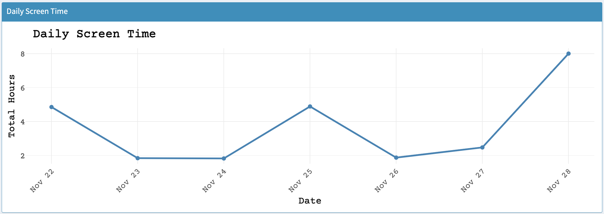
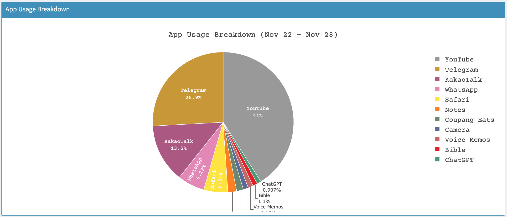

# AntiApp: Screen Time Reduction App

AntiApp is a Shiny-based application designed to help users monitor and reduce their screen time. This application allows users to set goals, track their app usage habits, and visualize their progress toward reducing screen time.

---

## Features

- **Dashboard Interface**: An intuitive interface for navigation, with sections such as About, Home, Set a Goal, Results, and References.
- **Data Visualization**: Displays daily screen time trends, app usage breakdowns, and reduction plans using `ggplot2` and `plotly`.
- **Goal Setting**: Users can set personalized goals for daily app usage limits and receive a structured plan to reduce screen time.
- **Real-Time Updates**: Interactive and dynamic UI updates based on user input.
- **Customization**: Uses modern design principles, including Google Fonts and responsive layouts.

---

## Getting Started

### Prerequisites

- R version 4.0.0 or higher.
- The following R libraries:
  - `shiny`
  - `shinydashboard`
  - `ggplot2`
  - `dplyr`
  - `readr`
  - `shinythemes`
  - `shinycssloaders`
  - `plotly`
  - `DT`
  - `RColorBrewer`

### Installation

1. Clone this repository or download the source code.
2. Install the required libraries in R by running:
   ```R
   install.packages(c("shiny", "shinydashboard", "ggplot2", "dplyr", "readr",
                      "shinythemes", "shinycssloaders", "plotly", "DT", "RColorBrewer"))
   ```

---

## Usage

1. Open the `AntiApp` project directory in RStudio or any R environment.
2. Place your screen time data file named `screen_time.csv` in the working directory.
3. Run the app using:
   ```R
   shiny::runApp()
   ```
4. Navigate through the app tabs to explore features:
   - **About**: Learn more about the app.
   - **Home**: View and analyze daily screen time trends and app usage breakdowns.
   - **Set a Goal**: Define app-specific daily limits and generate a reduction plan.
   - **Results**: Track progress and view reduction plans.
   - **References**: Access additional resources.

---

## Data Format

The app requires a CSV file (`screen_time.csv`) with the following columns:
- **Date**: Date in YYYY/MM/DD format.
- **UserID**: Unique identifier for each user.
- **AppName**: Name of the application.
- **AppHours**: Total hours spent on the application in a day.
- **AppMinutes**: Remaining minutes spent on the application in a day.

---

## Screenshots

- **Dashboard Overview**  
  

- **Daily Screen Time Trends**  
  

- **App Usage Breakdown**  
  

---

## License

This project is licensed under the MIT License. See the `LICENSE` file for details.

---

## Acknowledgments

- **Libraries**: A special thanks to the developers of the R libraries used in this project.
- **Font**: This app uses the [Courier Prime](https://fonts.google.com/specimen/Courier+Prime) font.

---

## Contact

For queries or suggestions, please reach out to:
- [YUGAY DMITRIY]
- Email: [yudm3off@gmail.com]
- GitHub: [https://github.com/yudm3/AntiApp]

